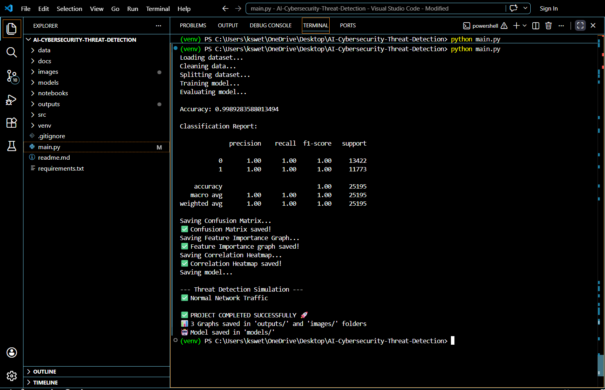
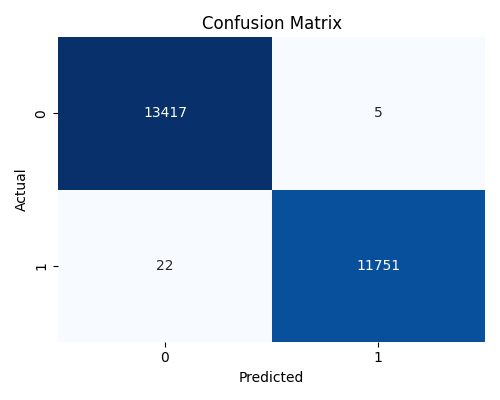
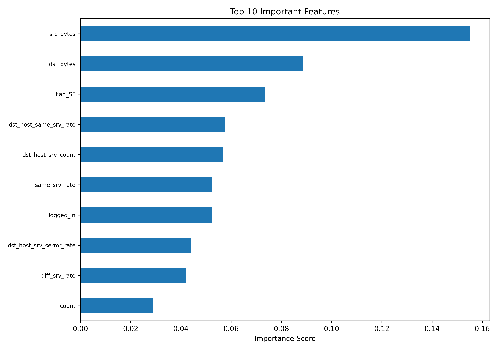
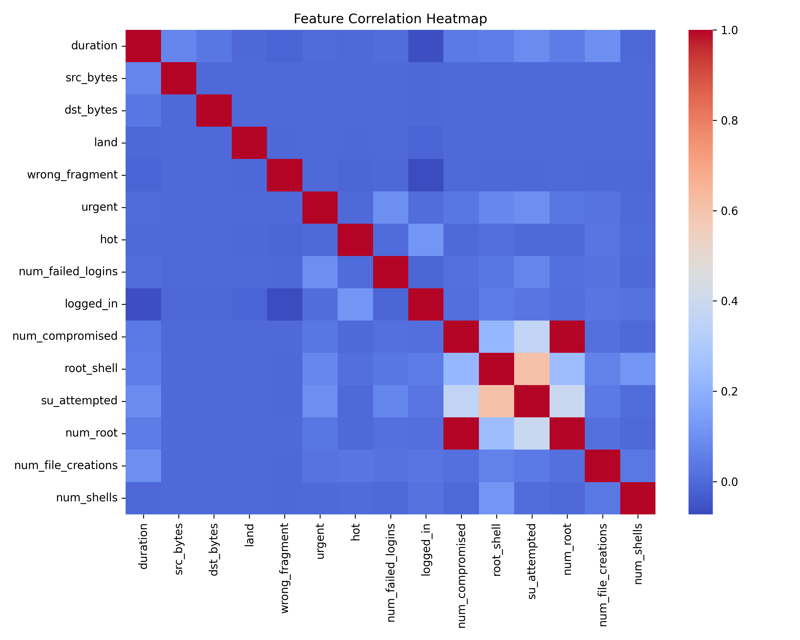

# 🔐 AI-Based Cybersecurity Threat Detection System

## 📌 Overview

This project implements a **Machine Learning-based cybersecurity system** to detect malicious network activities.
It classifies incoming network traffic as **Normal** or **Attack**, enabling early threat identification.

The system leverages supervised learning techniques and provides **visual insights** through multiple analytical graphs.

---

## 🎯 Objectives

* Build a robust ML model for threat detection
* Analyze network traffic patterns
* Visualize results using graphs and heatmaps
* Simulate real-time cybersecurity monitoring
---

## 🛠️ Tech Stack & Tools Used

### 🔹 Programming Language
- Python

### 🔹 Libraries & Frameworks
- Pandas → Data manipulation and preprocessing  
- NumPy → Numerical computations  
- Scikit-learn → Machine Learning (Random Forest Classifier)  
- Matplotlib → Basic data visualization  
- Seaborn → Advanced visualization (Heatmaps, Confusion Matrix)

### 🔹 Machine Learning Model
- Random Forest Classifier (Supervised Learning)

### 🔹 Dataset
- NSL-KDD / KDD Cup Dataset (Cybersecurity dataset from Kaggle)

### 🔹 Development Tools
- VS Code → Code editor  
- Git → Version control  
- GitHub → Project hosting and collaboration  

### 🔹 Visualization Outputs
- Confusion Matrix  
- Feature Importance Graph  
- Correlation Heatmap  


---

## 📂 Project Structure

```
AI-Cybersecurity-Threat-Detection/
│── data/                 # Dataset
│── images/               # Screenshots & graphs
│── models/               # Saved ML model (.pkl)
│── outputs/              # Generated results
│── main.py               # Main execution file
│── requirements.txt      # Dependencies
│── README.md             # Documentation
```

---

## ⚙️ Installation & Execution

### 1. Clone Repository

```
git clone https://github.com/Swetha07062003/AI-Cybersecurity-Threat-Detection.git
cd AI-Cybersecurity-Threat-Detection
```

### 2. Setup Virtual Environment (Optional)

```
python -m venv venv
venv\Scripts\activate
```

### 3. Install Dependencies

```
pip install -r requirements.txt
```

### 4. Run the Project

```
python main.py
```

---

## 📊 Model Performance

The trained model achieves **~99.8% accuracy**, indicating highly effective classification.

### 🔹 Classification Metrics

* Precision: **1.00**
* Recall: **1.00**
* F1-Score: **1.00**

---

## 📸 Execution Proof

### 🔹 Terminal Output




---

## 📈 Visualizations

### 🔹 Confusion Matrix



### 🔹 Feature Importance Graph



### 🔹 Correlation Heatmap



---

## 🤖 Threat Detection Simulation

The system performs a simple real-time simulation:

* ✅ Detects **Normal Traffic**
* ⚠️ Identifies **Malicious Behavior**

---

## 💡 Key Highlights

* High-accuracy ML model (~99.8%)
* Clean data preprocessing pipeline
* Feature importance analysis
* Correlation-based insights using heatmaps
* Organized project structure for scalability

---

## ⚠️ Limitations

* High accuracy may indicate dataset bias or imbalance
* Model performance may vary on real-world data
* Limited real-time deployment capability

---

## 🚀 Future Enhancements

* 🔹 Integration with real-time network traffic (live packets)
* 🔹 Deployment using **Streamlit / Flask dashboard**
* 🔹 Use of Deep Learning models (LSTM, CNN)
* 🔹 Integration with Intrusion Detection Systems (IDS)
* 🔹 Cloud deployment (AWS / Azure)
* 🔹 Alert system (Email / SMS notifications)
* 🔹 Model optimization for large-scale data

---

## 👩‍💻 Author

**Swetha K**


---

## 📌 Conclusion

This project demonstrates how **Machine Learning can enhance cybersecurity systems** by detecting threats efficiently and visualizing network behavior.

It serves as a strong foundation for building **advanced, real-time cyber defense systems**.

---

## 📬 Contact

GitHub: https://github.com/Swetha07062003
